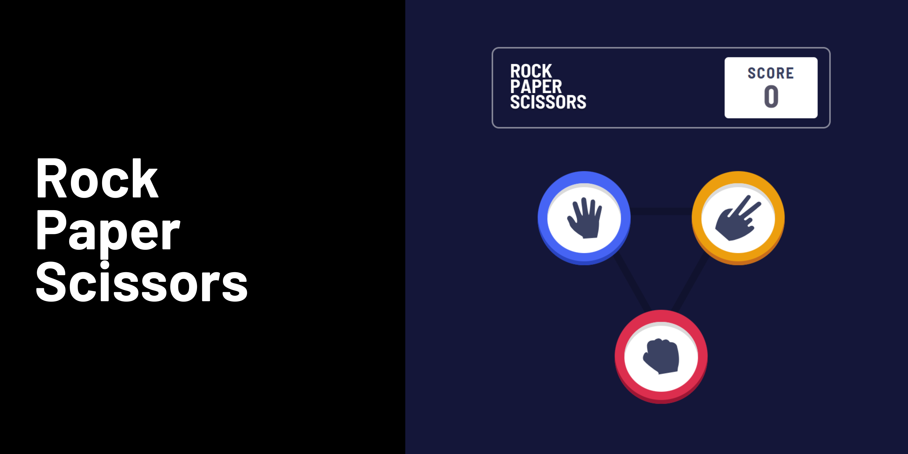
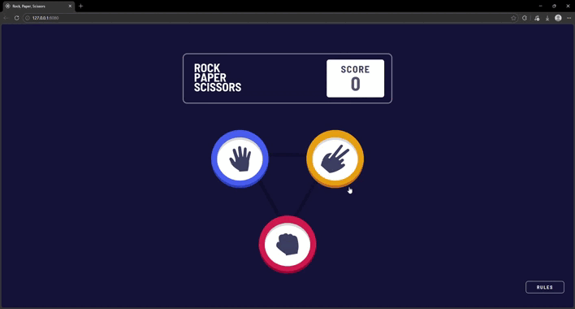

<h1 align="center">

</h1>

<h2 align="center"> 
	Rock, Paper, Scissors game ✅
</h2>

<h2 id="#description">Project description 📚</h2>
This project is a rock, paper, scissors game developed with basic JavaScript, HTML and CSS, where my biggest challenge was creating the game's interface and logic

<h3 id="#description">Preview project:</h3>

## Technology

This project was developed with the following technologies:

- [HTML](https://reactjs.org)
- [CSS](https://www.typescriptlang.org/)
- [Vanilla Js](https://styled-components.com/)

## Links

- [Preview project](https://vinicius-rockpaperscissors.netlify.app/)

 

## 👨🏽‍💻 Author

- [Frontend Mentor](https://www.frontendmentor.io/profile/viniciusshenri96)
- [Linkedin](https://www.linkedin.com/in/vinícius-henrique-7a2533229/)
